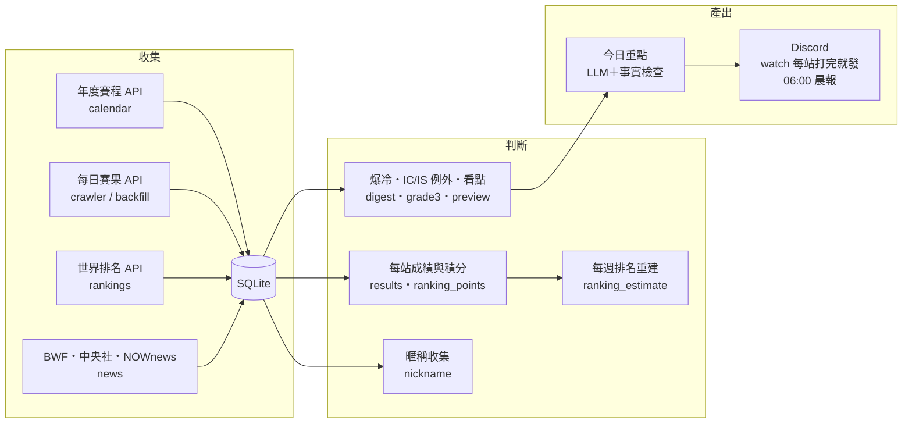

# badminton-daily-agent（羽球日報 Agent）

每天自動收集國際羽球賽果與新聞，記住每位選手的歷史，每站比賽打完就把賽果、看點推送到 Discord，做為一分鐘 IG 影片的素材。

作者是前職業羽球雙打選手、羽球教練。這個專案把領域知識（賽制、排名規章、選手生態）寫成資料管線與 LLM 應用，重點放在**事實正確**：日報上的每個比分、名字、排名都查得回資料庫。

文件：[開發計畫](docs/plan.md) · [資料來源實測](docs/data-sources.md) · [排名重建驗證報告](docs/ranking-validation.md) · [進度紀錄](docs/status.md) · [給 Claude Code 的說明](CLAUDE.md)

## 做了什麼



- **資料**：2016–2026 追蹤範圍內 1,202 站賽事，十年回補目前約 16 萬場比賽、36 萬局比分、1.6 萬位選手；另有 API 還留著的 60 週官方排名，約 15 萬筆
- **世界排名**：2017 年起的官方每週排名（每項前 100 名），用來判斷每場比賽當週的排名與「爆冷」
- **排名重建（方法展示）**：在找到官方歷史排名之前，先照 BWF 規章自己重算排名，再用 60 週官方排名驗證：**前 10 名 95–99% 的估算誤差在 2 名以內**，過程中找到並修正 7 個系統性錯誤（見[驗證報告](docs/ranking-validation.md)）
- **即時推送**：`brief.watch` 每 30 分鐘檢查。每站在當地當天打完就發一則，內容有賽果、今日重點、明日看點；看點的選場理由由規則產生。沒有大賽的空檔週，IC／IS 會升格改用同樣方式發送
- **LLM 只改寫、不新增事實**：今日重點產生後，程式逐一核對比分（整組比對，正反順序皆可）、數字與中英文名字，查不到的標「⚠️待確認」；多段落或出現自我更正字眼的輸出不採用。實測曾抓到 LLM 捏造的團體賽比分，已做成回歸測試
- **中文化**：項目、輪次、國家、賽事名稱轉成台灣用語。台灣選手的中文名只用人工對照表（中華羽協甲組名單），**不音譯**
- **守規矩的爬蟲**：每次請求間隔 2 秒、遵守 robots.txt（聯合新聞網明確禁止 AI 爬蟲，所以不抓）、重跑只更新不重複寫入、測試全用真實 API 回應

## 模組

| 模組 | 作用 |
|---|---|
| `brief/calendar.py` | 年度賽程 → 追蹤範圍內的賽事與層級 |
| `brief/crawler.py` | 抓一站的每日賽果並寫入 SQLite（含團體賽拆單場），冪等 |
| `brief/backfill.py` | 十年回補：由新到舊、可中斷續跑、失敗站可重試 |
| `brief/rankings.py` | 世界排名週快照與 2017 年起的官方歷史排名（`--history`）；`rank_lookup` 先查官方，查不到再用估算 |
| `brief/ranking_points.py` | BWF 積分規則表（2017 以前／2018／2024 第 17 週起三版） |
| `brief/results.py` | 由比賽推每站成績與積分：輪空、資格賽、lucky loser、小組賽、團體賽（規章 7.2） |
| `brief/ranking_estimate.py` | 每週排名重建：52 週、最好 10 站、同分規則、凍結期 |
| `brief/validate.py` | 重建結果對官方排名的驗證指標 |
| `brief/watch.py` | 每站當地當天打完就發；保險發送、補發、告警 |
| `brief/preview.py` | 明日看點：五條選場規則、台灣時間換算 |
| `brief/digest.py` | 賽果格式、爆冷規則（種子被 50／100 名外擊敗）、06:00 晨報 |
| `brief/grade3.py` | IC／IS 不推送，只推明確規則的例外 |
| `brief/news.py`、`brief/nickname.py` | 新聞列表收集；選手暱稱自動收集（必須附原文證據） |
| `brief/llm.py` | LLM 介面：依用途選模型、用量與費用紀錄、事實檢查 |
| `brief/zh.py`、`config/players_zh.csv` | 中文化對照表；台灣選手中文名 |
| `brief/daily.py` | 06:00 排程入口：賽程、賽果、新聞、排名、晨報 |
| `tests/` | 147 個測試，fixture 全部是真實 API 回應或真實新聞標題 |

## 安裝與執行

```bash
python -m venv .venv && source .venv/bin/activate   # Windows: .venv\Scripts\activate
pip install -e ".[dev]"
cp .env.example .env                                  # 填入 Discord webhook、ANTHROPIC_API_KEY
python -m pytest -q

python -m brief.calendar --from 2016 --to 2026 --db data/brief.db   # 賽事清單與層級
python -m brief.backfill run --db data/brief.db                     # 十年回補（約 5,000 個請求，可中斷續跑）
python -m brief.rankings --db data/brief.db                         # 補齊排名快照（最近 60 週，每項前 500 名）
python -m brief.rankings --db data/brief.db --history               # 官方歷史排名（2017 起，每項前 100 名）
python -m brief.watch --db data/brief.db --dry-run                  # 每站打完就發（只印出）
python -m brief.daily --db data/brief.db --send                     # 每日收集＋晨報
python -m brief.validate --db data/brief.db                         # 排名重建驗證
```

Windows 排程（06:00 晨報＋每 30 分鐘 watch）：`scripts/register_task.ps1`。

## 刻意不做的事

- 不自動發文：系統只產草稿，由作者審稿、錄製、發布
- 不用轉播畫面、不轉貼新聞：新聞只當資訊來源，改寫並附出處
- 不收 Future Series、青少年、元老、身障賽事（追蹤範圍見 CLAUDE.md 已決議表）
